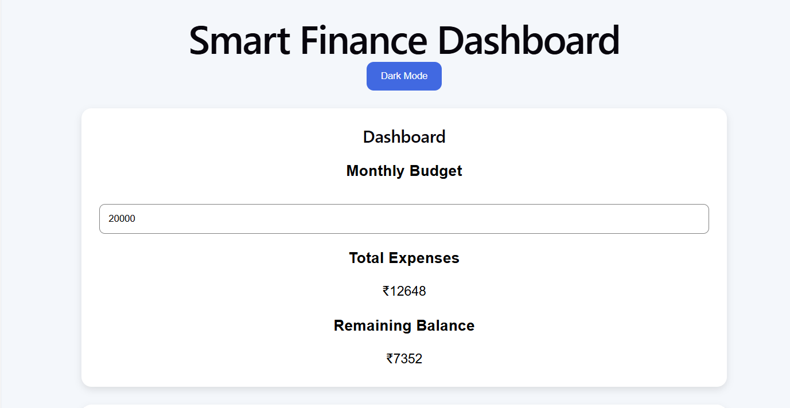
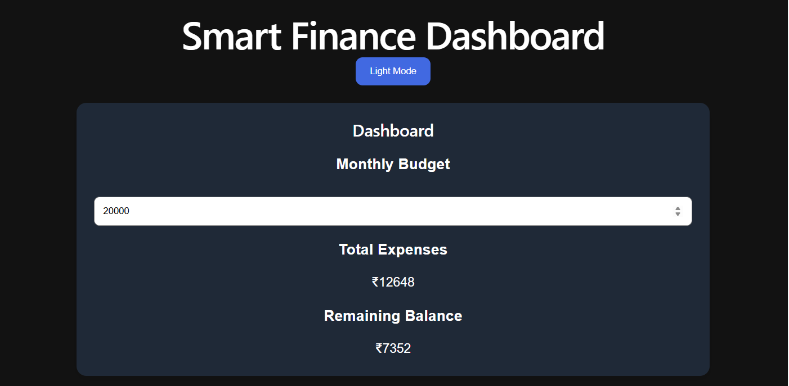
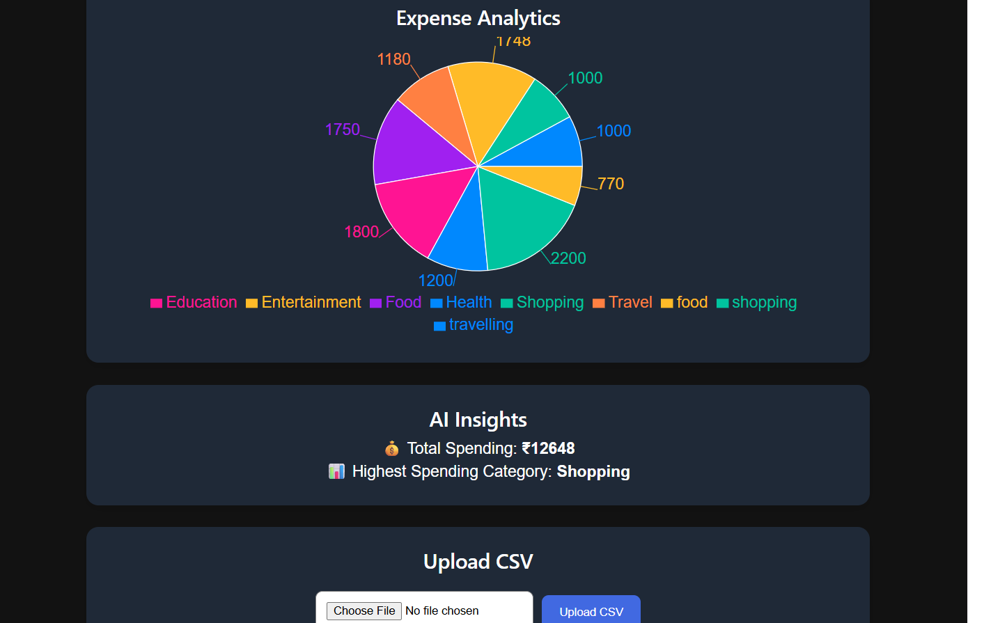
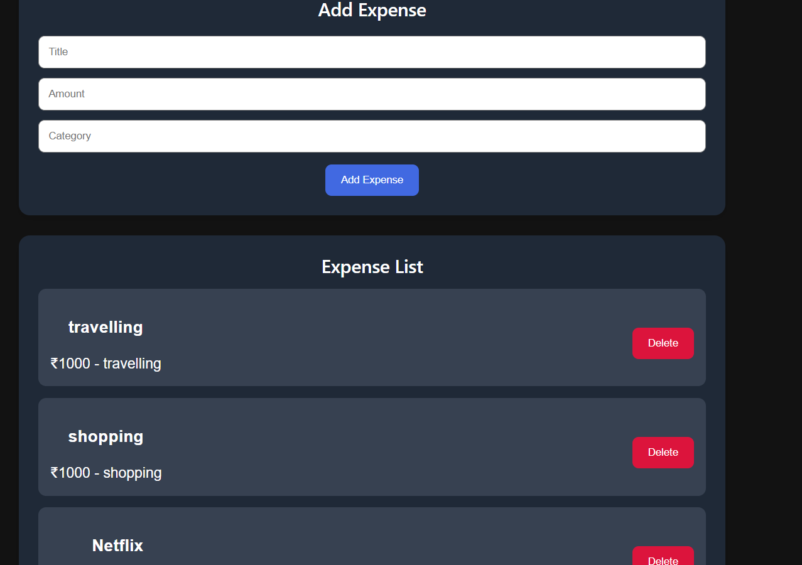

# Smart Finance Dashboard

A full-stack finance management web application that helps users track expenses, monitor budgets, visualize analytics, and upload CSV files for expense management.

---

# Features

- Add and manage expenses
- Monthly budget tracking
- Expense analytics with charts
- Dark mode support
- CSV upload support
- Responsive UI
- MongoDB database integration

---

# Tech Stack

## Frontend
- React.js
- Vite
- Axios
- Recharts
- CSS

## Backend
- Node.js
- Express.js
- MongoDB
- Mongoose

---

# Folder Structure

smart-finance-dashboard/
│
├── client/ # Frontend
├── server/ # Backend
├── screenshots/
├── README.md
└── package.json

---

# Installation

## Clone Repository

```bash
git clone https://github.com/Archupola/smart-finance-dashboard.git
cd smart-finance-dashboard
```

# Frontend Setup

```bash
cd client
npm install
npm run dev
```

# Backend Setup

```bash
cd server
npm install
npm start
```

---

# Environment Variables

Create a `.env` file inside the server folder:

```env
MONGO_URI=your_mongodb_connection_string
PORT=5000
```

---

# Live Demo

## Frontend

https://smart-finance-dashboard-new.vercel.app/

---

## Backend

https://smart-finance-dashboard-uwfm.onrender.com/

---

# Screenshots

## Dashboard


## Dark Mode


## Analytics


## Expense List


---

# Future Improvements

- User authentication
- AI-based expense insights
- Export reports as PDF
- Multi-user support
- Mobile responsiveness improvements

---

# Author

Archana Pola

GitHub:
https://github.com/Archupola